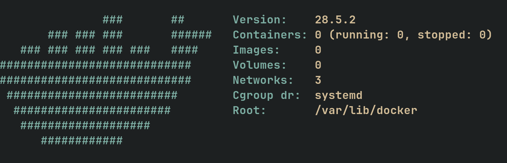

<h1 align="center">dockerfetch</h1>
<h3 align="center">Fast Docker info fetcher written in Go</h3>

<div align="center" style="padding-top: 2em !important; padding-bottom: 2em; !important">
    
</div>

[Installation](#Installation) • [Usage](#Usage)

 

# Prerequisites

- Go 1.25.6 or higher
- Docker installed and running
- Git and Just (for building from source)


# Installation

```bash
git clone https://github.com/whyhilde/dockerfetch.git
cd dockerfetch
just install
```
